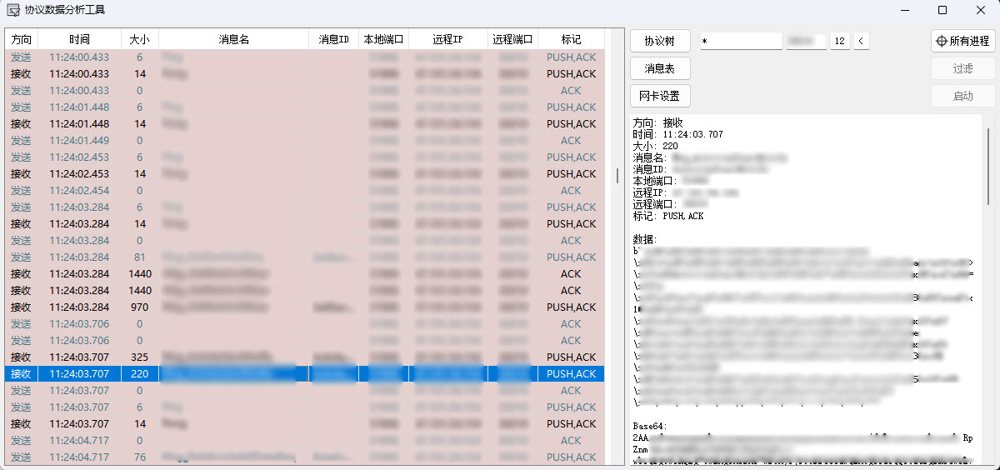

# SocketPacket

## 游戏协议数据抓取解析工具
只要将所有的proto放进去，执行gen-protos.py，然后修改ProtobufData.py文件，在ProtobufData里写上端口，就可以抓取端口的TCP数据。
修改ProtobufData.py里的ParsePacketData函数和ServerData1，可以将抓到的二进制自动解析为对应的Message

### 项目说明
需要安装PySide2模块
进程id读取用到了pywin32模块
抓包用到了WinPcap，需要预先安装，在_files里面，网络上下载的亦可使用

### 用到的库
pip install pypiwin32
pip install pyside2

### 使用说明
生成exe之后
将proto文件放到protobuf/protos/Proto/里面
执行gen-protos.py脚本，将proto文件编译成对应的py文件
修改protobuf/ProtobufData.py文件
将protobuf文件夹复制到exe同目录里

ProtobufData.py格式参考：

```python
ServerData1 = \
{
    "Msg_TestMessage": { "pb":"protobuf.pbs.Test_pb2", "msgs":["TestMessage"] },
}

ProtobufData = (
    {
        "ip": "*",
        "port": "443",
        "headlen": "12",
        "endian": "<",
        "color": "#E6D0CE",
        "data": ServerData1
    },
)
```

界面效果图：

